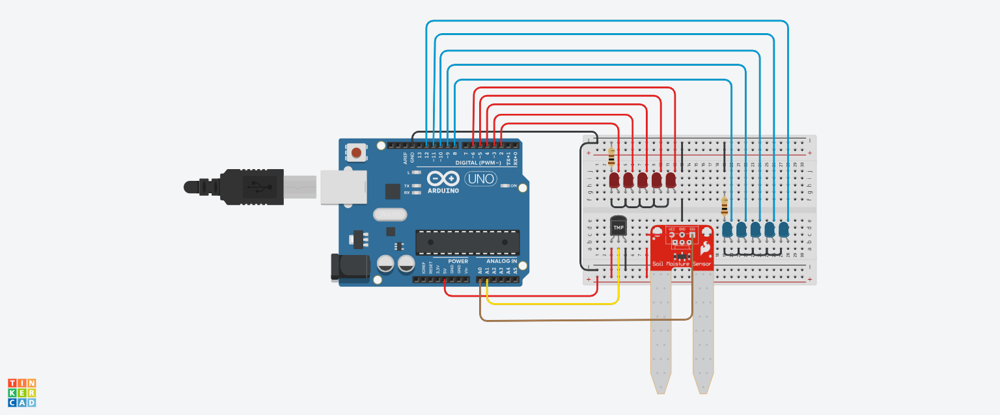

# 🌡️ Humidity and Temperature Monitoring System  

This project is an **Arduino-based humidity and temperature monitoring system** that uses **LED indicators** to display current conditions. The system reads values from analog sensors and provides real-time feedback through visual alerts.

## 📸 Circuit Diagram  
Here’s the circuit setup for this project:  



## 🔧 Features  
✅ **Real-time monitoring** of humidity and temperature  
✅ **LED indicators** to display different humidity and temperature ranges  
✅ Easy to customize and expand for additional features  

## 🛠 Components Used  
- **Arduino Board** (Uno/Nano)  
- **Red LEDs** (5)  
- **Blue LEDs** (5)  
- **Humidity Sensor** (e.g., DHT11/DHT22)  
- **Temperature Sensor** (e.g., LM35 or similar)  
- **Resistors & jumper wires**  

## 🚀 How It Works  
1. **Connect the Circuit**: Follow the diagram above.  
2. **Upload the Code**: Load `temperature-and-soil-sensors.ino` to your Arduino.  
3. **Power On**: The system will read humidity and temperature values and display them via the LEDs.  

## 📜 Code  
```cpp
// RED LEDS
#define RED1 2
#define RED2 3
#define RED3 4
#define RED4 5
#define RED5 6

// BLUE LEDS
#define BLUE1 8
#define BLUE2 9
#define BLUE3 10 
#define BLUE4 11
#define BLUE5 12

// Ranges
#define RANGE1 20
#define RANGE2 40
#define RANGE3 60
#define RANGE4 80
#define RANGE5 100

#define MAX_ANALOG 876
#define DEFAULT 0
#define MAX_PERCENTAGE 100
#define MAX_ANALOG1 358
#define LOW_ANALOG1 20
#define MAX_DEGREE 125
#define LOW_DEGREE -40

// Delay
#define TIME 800

// Variables
float temp;
int humidity;
float analog_value;
float analog_value1;

void setup() {
  Serial.begin(9600);
  
  for (int red = 2; red <= 6; red++) {
    pinMode(red, OUTPUT);
  }
  
  for (int blue = 8; blue <= 12; blue++) {
    pinMode(blue, OUTPUT);
  }
}

float map(float x, float in_min, float in_max, float out_min, float out_max) {
  return (x - in_min) * (out_max - out_min) / (in_max - in_min) + out_min;
}

void loop() {
  // Process Of Checking Humidity
  analog_value = analogRead(A0);
  humidity = map(analog_value, DEFAULT, MAX_ANALOG, DEFAULT, MAX_PERCENTAGE);
  
  Serial.print("Now Humidity is: ");
  Serial.print(humidity);
  Serial.println("%");
  delay(TIME);

  // LED logic for humidity
  if (humidity <= RANGE1) {
    digitalWrite(BLUE1, HIGH);
    digitalWrite(BLUE2, LOW);
    digitalWrite(BLUE3, LOW);
    digitalWrite(BLUE4, LOW);
    digitalWrite(BLUE5, LOW);
  }
  // Additional humidity conditions...

  // Process Of Checking Temperature
  analog_value1 = analogRead(A1);
  temp = map(analog_value1, LOW_ANALOG1, MAX_ANALOG1, LOW_DEGREE, MAX_DEGREE);
  
  Serial.print("Now Temperature is: ");
  Serial.print(temp);
  Serial.println("C");
  delay(TIME);

  // LED logic for temperature
  if (temp <= RANGE1) {
    digitalWrite(RED1, HIGH);
    digitalWrite(RED2, LOW);
    digitalWrite(RED3, LOW);
    digitalWrite(RED4, LOW);
    digitalWrite(RED5, LOW);
  }
  // Additional temperature conditions...
}
